# RC.HyRe

a unified application for onboarding candidates e2e.

the core idea behind this was manual handling of applications, scattered scheduling of interviews and scattered tracking of status

my idea is to provide self-help portal for all stakeholders... candidates, HR, top-executives, interviewer's, managers everyone

---

---

## Brainstorming

**Module 1 — Application tracking**

- Job requisition creation with approval flow
- Candidate profile ingestion (manual + resume parsing)
- Kanban-style pipeline view (applied → screened → interview → offer → hired/rejected)
- Bulk status updates and candidate tagging
- Duplicate detection across requisitions

**Module 2 — Interview scheduling**

- Interviewer availability calendar sync (Google / Outlook)
- Candidate self-scheduling link (picks from available slots)
- Panel interview coordination (multi-interviewer, single slot)
- Automated reminders 24h and 1h before
- Reschedule / cancel flow with reason capture

**Module 3 — Candidate communications**

- Templated email library (acknowledgement, rejection, invite, offer)
- Trigger-based auto-sends (status change → email fires)
- Candidate-facing status portal ("where am I in the process?")
- Two-way reply threading logged against the candidate profile
- Opt-out / communication preference management

**Module 4 — Stakeholder visibility**

- Role-specific dashboards: HR sees full pipeline, managers see their open roles, execs see aggregate funnel
- Scorecard entry for interviewers (structured feedback form post-interview)
- Hiring manager approval gate before offer goes out
- Comment threads on candidate profiles (internal, not visible to candidate)

**Module 5 — Offer & onboarding**

- Offer letter generation from template with dynamic fields (salary, start date, role)
- Multi-level approval workflow before sending
- Digital signature collection (DocuSign or native)
- Post-acceptance onboarding checklist assigned to HR + new hire
- IT / access provisioning task list triggered on acceptance

**Module 6 — Analytics & reports**

- Time-to-hire and time-in-stage metrics per role
- Funnel drop-off rates (where are candidates falling out?)
- Interviewer load distribution
- Source attribution (where are good hires coming from?)
- Exportable reports for leadership review

---
